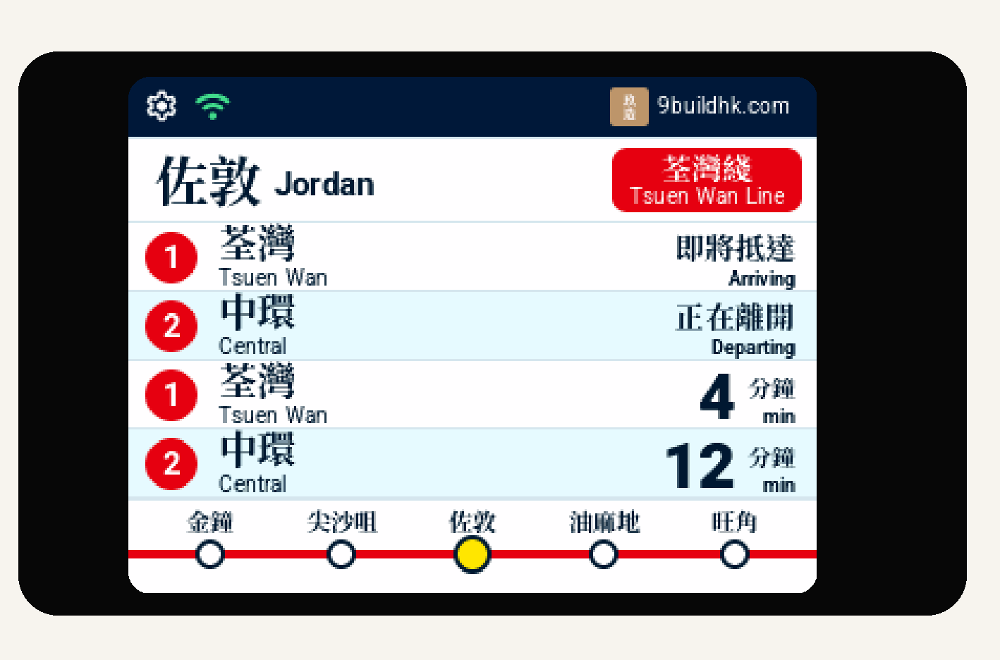
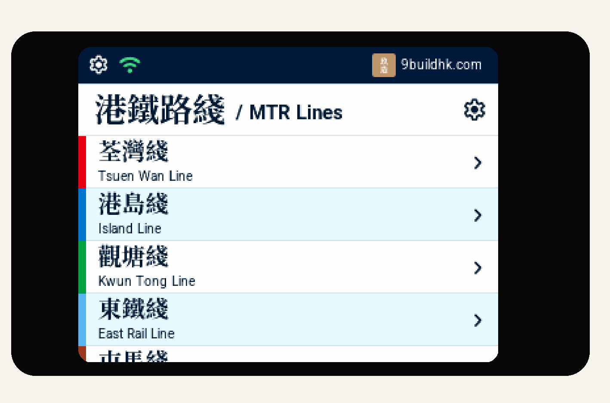

<p align="center">
  <a href="https://9buildhk.com">
    
  </a>
</p>

<h1 align="center">香港鐵路到站屏 / HK Railway ETA Display</h1>

<p align="center"><strong>個人版（CE）</strong></p>

<p align="center">
  <a href="README.md">English</a> ·
  <a href="README.zh-HK.md">繁體中文（香港）</a>
</p>

<p align="center">
  <a href="https://github.com/9build/hk-railway-eta-display-ce/releases">
    
  </a>
  <a href="https://github.com/9build/hk-railway-eta-display-ce/releases">
    
  </a>
</p>

<p align="center">
  <a href="https://9buildhk.com">9buildhk.com</a> ·
  <a href="../../releases">GitHub Releases</a> ·
  <a href="../../releases/latest/download/FLASHING.zh-HK.md">繁體中文（香港）刷寫指南</a> ·
  <a href="../../releases/latest/download/FLASHING.md">English flashing guide</a>
</p>

> 為查閱港鐵重鐵下一班車而設的桌面 ETA display。

可直接在 display 上連接相容的 2.4 GHz Wi-Fi network，毋須手機 app 或額外 gateway。連接後，香港鐵路到站屏會讀取港鐵公開 ETA 資料，顯示下一班車、月台及目的地。產品由香港的 [玖造 9 Build](https://9buildhk.com) 製作。

## 主要功能

<table>
  <tr>
    <td width="33.33%" align="center" valign="top">
      <br>
      <strong>Live ETA</strong><br>
      <sub>查看下一班車、月台及目的地。</sub>
    </td>
    <td width="33.33%" align="center" valign="top">
      <br>
      <strong>選擇路線</strong><br>
      <sub>選擇要追蹤的路線及車站。</sub>
    </td>
    <td width="33.33%" align="center" valign="top">
      <br>
      <strong>內置資訊及宣傳畫面</strong><br>
      <sub>ETA 畫面可與內置資訊或宣傳 display 輪播，形式如港鐵車廂常見的資訊及廣告顯示。</sub>
    </td>
  </tr>
</table>

產品功能及 screen design 會在日後的 Release 持續改進；安裝新版本前，請先閱讀 release notes。

## 安裝個人版（CE）

> **購買產品的重要提示：** 如果你購買的是由玖造 9 Build 製作及交付的顯示器，請勿自行下載、刷寫或重灌本頁的個人版（CE）韌體。本 repository 只供在你自己擁有及直接控制的相容硬件上安裝 CE 使用；如需更新、維修或處理刷寫問題，請先聯絡玖造 9 Build。

請使用適用於 classic ESP32-WROOM-32E 主機板及 **ILI9341V** display 的 installer。先到 [GitHub Releases](../../releases) 下載相符檔案及 `SHA256SUMS`，然後核對 checksum：

```sh
shasum -a 256 platform9-ce-esp32e-ili9341-28-install.bin
```

### 查找 USB serial port 名稱

使用 `esptool` 前，請先以 USB 連接顯示屏，然後確認 serial port 名稱。如不確定，
可先拔除再重新連接主機板；新出現的項目通常就是正確名稱。請先關閉 Arduino IDE、
serial monitor 或任何正在使用該 port 的應用程式。

- **macOS：** 在 Terminal 執行 `ls /dev/cu.*`。常見名稱包括
  `/dev/cu.usbserial-XXXX`、`/dev/cu.SLAB_USBtoUART` 或 `/dev/cu.wchusbserial*`。
- **Linux：** 在 terminal 執行 `ls /dev/ttyUSB* /dev/ttyACM*`。常見名稱包括
  `/dev/ttyUSB0` 和 `/dev/ttyACM0`。如顯示權限不足，請將使用者帳戶加入 `dialout`
  group，登出再登入後重試。
- **Windows：** 開啟 **Device Manager** → **Ports (COM & LPT)**，尋找新連接的 USB
  serial device；使用其顯示的名稱，例如 `COM3` 或 `COM5`。

使用 Espressif `esptool` 刷寫已合併的 Firmware installer。請將 serial port 改為你的裝置：

```sh
python3 -m esptool --chip esp32 --port /dev/cu.usbserial-XXXX --baud 460800 erase-flash
python3 -m esptool --chip esp32 --port /dev/cu.usbserial-XXXX --baud 460800 write-flash --flash-size 4MB 0x0 platform9-ce-esp32e-ili9341-28-install.bin
```

Windows 請使用 Device Manager 顯示的 `COM` 名稱；如 Python 指令為 `python`，
可使用例如 `python -m esptool --port COM3 ...`。

如需 Windows 指令、USB download mode 或 troubleshooting，請閱讀[繁體中文（香港）刷寫指南](../../releases/latest/download/FLASHING.zh-HK.md)或 [English flashing guide](../../releases/latest/download/FLASHING.md)。Arduino IDE 並非支援的 installer 方法。

## 下載前請閱讀

請先閱讀 Release 內的 `LICENSE.txt`。個人版（CE）只可在你自己擁有及直接控制的硬件上，作個人、私人及非商業用途安裝及使用。每個 Release 隨附的 licence 為準。

## 連結

- [玖造 9 Build · 9buildhk.com](https://9buildhk.com)
- [下載頁](https://9buildhk.com/#download)
- [個人版（CE）Releases](../../releases)
- [港鐵 Open Data ETA 介面](https://rt.data.gov.hk/v1/transport/mtr/getSchedule.php)

本產品由獨立創作者製作，與港鐵公司、DATA.GOV.HK 或任何鐵路營運商並無關係，亦不代表獲其認可或支持。
